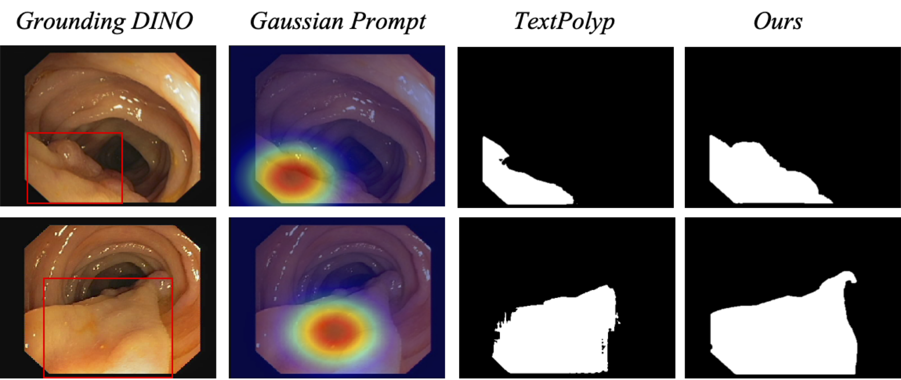
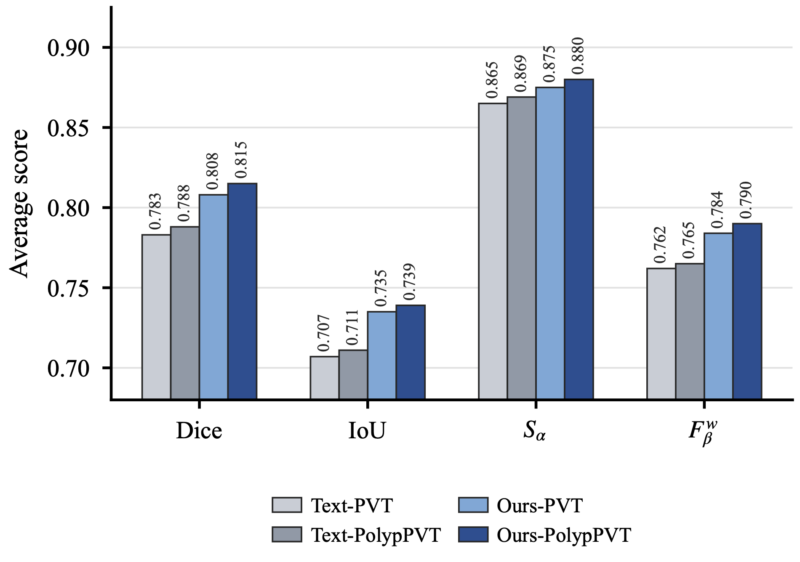

# PointPolyp

This repository is the anonymized project page for the ICASSP2027 submission
**PointPolyp: Polyp Segmentation with Point-Only Supervision**.

PointPolyp studies strict point-only polyp segmentation, where each training
image is annotated with only one foreground point and one background point.
The method does not use pixel-wise masks, text prompts, external detectors, or
bounding-box prompts during training. It converts sparse point clicks into
dense Gaussian prompts with a Dynamic Gaussian Prompt Adapter (DGPA), queries a
frozen Segment Anything Model (SAM) teacher, refines pseudo-labels with a
Pseudo-label Refinement Module (PRM), and trains a student network with
noise-aware supervision and teacher-guided mixed augmentation. During
inference, only the trained student network is used.

## Framework Overview

DGPA transforms foreground/background points into dense Gaussian prompts for
the frozen SAM teacher. PRM refines the selected teacher mask into a soft
pseudo-label, which supervises the student together with point constraints,
weak-strong consistency, auxiliary supervision, and teacher-guided mixed
augmentation.

## Quantitative Results

PointPolyp achieves the best average performance among the compared
point-supervised and point-plus-text methods while using the stricter
point-only supervision setting.

| Method | Dice | IoU | S-measure | Weighted F-measure |
| --- | ---: | ---: | ---: | ---: |
| TextPolyp + PVT-B2 | 0.783 | 0.707 | 0.865 | 0.762 |
| TextPolyp + Polyp-PVT | 0.788 | 0.711 | 0.869 | 0.765 |
| PointPolyp + PVT-B2 | 0.808 | 0.735 | 0.875 | 0.784 |
| PointPolyp + Polyp-PVT | **0.815** | **0.739** | **0.880** | **0.790** |

Per-dataset results of PointPolyp with the Polyp-PVT backbone are summarized
below.

| Dataset | Dice | IoU | S-measure | Weighted F-measure |
| --- | ---: | ---: | ---: | ---: |
| CVC-ClinicDB | 0.856 | 0.781 | 0.902 | 0.844 |
| Kvasir | 0.863 | 0.783 | 0.890 | 0.861 |
| CVC-300 | 0.847 | 0.775 | 0.918 | 0.820 |
| CVC-ColonDB | 0.795 | 0.705 | 0.853 | 0.766 |
| ETIS-LaribPolypDB | 0.712 | 0.649 | 0.835 | 0.661 |

## Qualitative Analysis

Fig. 3 compares predictions from point-supervised baselines, TextPolyp, and
PointPolyp. The point-adapted baselines often produce fragmented masks, miss
small lesions, or activate irrelevant mucosal regions. PointPolyp generally
preserves more complete lesion shapes and suppresses isolated false positives,
especially in small, low-contrast, and boundary-ambiguous cases.

Fig. 4 analyzes pseudo-label generation under different prompt priors.
Bounding-box prompts from Grounding DINO can under-cover large or elongated
polyps, which may truncate the SAM pseudo-label. The Gaussian prompt provides a
softer region prior centered on the point click and recovers more complete
pseudo-labels under the strict point-only setting.

Fig. 5 shows the average metric profile across five datasets. The improvement
appears consistently across Dice, IoU, S-measure, and weighted F-measure,
indicating that PointPolyp improves both region overlap and structural quality.
